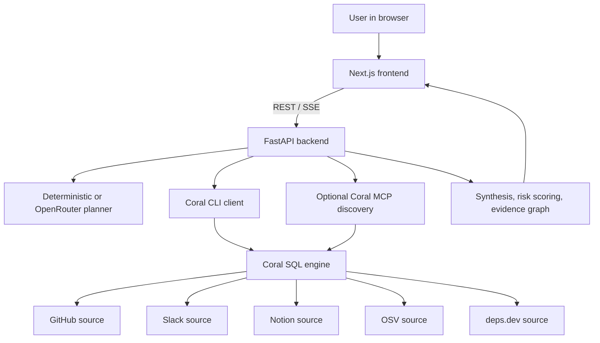
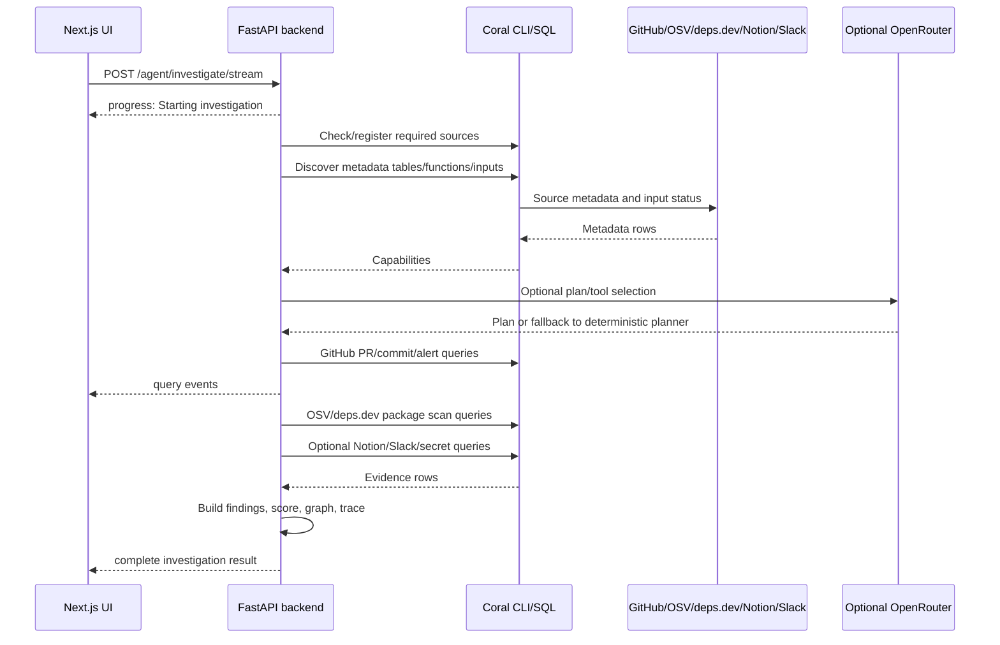

# HarborGuard

HarborGuard is a schema-aware security investigation platform powered by [Coral](https://withcoral.com/). It combines a FastAPI backend, a Next.js investigation UI, Coral SQL sources, OSV, deps.dev, GitHub, and optional Slack/Notion/OpenRouter context to answer questions like:

- Did dependency upgrades introduce risk and require policy review?
- Are there security policy violations in recent code changes?
- Have secrets or credentials been exposed in recent commits?
- Is the latest release safe to deploy to production?

The project is built around evidence-driven investigations: HarborGuard discovers which Coral sources and tables are available, plans a tool/query strategy, executes Coral SQL, synthesizes findings, and renders an interactive evidence graph plus detailed execution traces.

## Live links

- **Frontend app:** https://harborguard-security.vercel.app/
- **Backend API:** https://harborguard-api.onrender.com/
- **Demo video:** https://www.youtube.com/watch?v=YdDgWWssaks

Start with the frontend app for the full HarborGuard experience. The backend link exposes the deployed FastAPI service used by the frontend.

## Table of contents

- [Features](#features)
- [Architecture](#architecture)
- [Repository layout](#repository-layout)
- [Tech stack](#tech-stack)
- [How investigations work](#how-investigations-work)
- [Prerequisites](#prerequisites)
- [Configuration](#configuration)
- [Local development](#local-development)
- [Docker deployment](#docker-deployment)
- [Frontend deployment](#frontend-deployment)
- [API reference](#api-reference)
- [Coral sources](#coral-sources)
- [Testing and validation](#testing-and-validation)
- [Troubleshooting](#troubleshooting)
- [Security and privacy notes](#security-and-privacy-notes)
- [Extending HarborGuard](#extending-harborguard)

## Features

### Investigation modes

HarborGuard ships with four primary security workflows:

| Mode | Question focus | Main sources used |
| --- | --- | --- |
| Dependency Risk | Dependency upgrades, package CVEs, advisory metadata, dependency graph context | GitHub, OSV, deps.dev |
| Policy Violation | Recent code changes compared with internal security/compliance policy context | GitHub, Notion, deps.dev/OSV when relevant |
| Secrets Exposure | Exposed `.env` files, credentials, tokens, suspicious secret-bearing paths | GitHub code search and optional raw-file fallback |
| Release Safety | Production-readiness review using changes, findings, review signals, and policy context | GitHub, OSV, deps.dev, Notion |

### Core capabilities

- **Coral SQL integration** for GitHub, Slack, Notion, OSV, and deps.dev.
- **Runtime capability discovery** from Coral metadata tables and optional Coral MCP discovery.
- **Source connection workflow** from the UI using per-user tokens saved in browser `localStorage`.
- **Deterministic planner** with optional OpenRouter-powered AI planning.
- **Streaming investigations** via Server-Sent Events so the UI can show live progress and live SQL queries.
- **Repository-first package extraction** from PRs, commits, Dependabot alerts, and manifests.
- **Deep package scans** against OSV and deps.dev for up to five inferred package targets.
- **Secrets scan heuristics** that reduce false positives for templates like `.env.example`.
- **Evidence graph rendering** with React Flow, Dagre layout, animated edges, and custom node cards.
- **Investigation history** cached locally in the browser.
- **Docker-ready backend** with Coral CLI and Python dependencies bundled into one container.

## Architecture



At a high level:

1. The user selects an investigation mode or asks a custom question in the Next.js UI.
2. The UI sends repo inputs, optional package overrides, and saved credentials to the backend.
3. The backend verifies Coral sources and discovers available source schemas/tables.
4. HarborGuard plans the investigation using either deterministic logic or OpenRouter.
5. The backend runs Coral SQL queries, streams progress/query events, and collects rows.
6. Findings, review signals, scan coverage, risk score, reasoning trace, and graph data are returned.
7. The UI renders the assessment, evidence graph, source status, SQL/debug tabs, and cached history.

## Repository layout

```text
harborguard/
├── README.md                         # Root project guide
├── DOCKER.md                         # Focused backend Docker deployment guide
├── Dockerfile                        # FastAPI + Coral CLI backend image
├── docker-entrypoint.sh              # Container startup/source registration script
├── .env.example                      # Example backend environment file
├── backend/
│   ├── main.py                       # FastAPI app, endpoints, planner, investigation pipeline
│   ├── coral_client.py               # Coral CLI subprocess wrapper and credential context
│   ├── coral_mcp_client.py           # Optional JSON-RPC MCP discovery client
│   ├── llm_orchestrator.py           # OpenRouter planner/extractor/dynamic tool helpers
│   ├── fixtures/                     # Optional canned API responses for fixture mode
│   ├── pyproject.toml                # Python package metadata and FastAPI dependency
│   ├── uv.lock                       # uv lockfile
│   └── test_test_coral_repo.py       # Committed API validation helper
├── frontend/
│   ├── package.json                  # Next.js frontend dependencies/scripts
│   ├── next.config.ts
│   ├── src/app/page.tsx              # Landing page, credentials, source connect, presets
│   ├── src/app/dashboard/page.tsx    # Streaming investigation dashboard/results UI
│   ├── src/app/components/           # Evidence graph, schema panel, custom graph nodes/edges
│   ├── src/app/utils/                # API, credentials, history, flavor text, graph topology
│   └── public/logos/                 # Source logos used in the dashboard
├── coral-download/
│   └── README.md                     # Optional local Coral binary notes
├── coral-sources/
│   ├── README.md                     # Coral source install notes
│   ├── LICENSE-CORAL                 # License for vendored Coral source specs
│   └── community/
│       ├── osv/manifest.yaml         # Public OSV API Coral source
│       └── deps_dev/manifest.yaml    # Public deps.dev API Coral source
├── .dockerignore
└── .gitignore
```

## Tech stack

| Area | Technology |
| --- | --- |
| Backend API | Python 3.12, FastAPI |
| Python package manager | `uv` |
| Source/query layer | Coral CLI, Coral SQL, optional Coral MCP stdio |
| Frontend | Next.js 16, React 19, TypeScript |
| UI animation | `motion` |
| Evidence graph | `@xyflow/react`, `dagre` |
| Public vulnerability data | OSV API, deps.dev API via Coral source manifests |
| Optional AI planner | OpenRouter Chat Completions API |
| Container runtime | Docker, `python:3.12-slim`, Coral Linux install script |

## How investigations work



### Backend pipeline details

The backend pipeline is implemented mostly in `backend/main.py`:

1. **Credentials and settings**
   - `SourceCredentials` accepts GitHub, Slack, Notion, OpenRouter, and planner toggle values.
   - Request credentials override server environment variables for that request only.

2. **Source readiness**
   - Required investigation sources: `github`, `osv`, `deps_dev`.
   - Optional context sources: `slack`, `notion`.
   - Community sources (`osv`, `deps_dev`) are registered from `coral-sources/community/*/manifest.yaml` when possible.

3. **Capability discovery**
   - Default backend: Coral SQL metadata tables.
   - Optional backend: Coral MCP discovery when `HARBORGUARD_DISCOVERY_BACKEND=mcp`.
   - Produces source/tool availability and missing input status.

4. **Planning**
   - Deterministic planner maps question intent to known tools.
   - Optional OpenRouter planner can choose tools and later perform dynamic tool calls.
   - Plans are validated against discovered capabilities before execution.

5. **Repository context pass**
   - Pull requests and commits are always inspected first when available.
   - GitHub Dependabot org alerts are disabled unless `HARBORGUARD_ENABLE_GITHUB_ALERTS=true` because the org endpoint often needs special permissions.

6. **Package target extraction**
   - Package candidates can come from user overrides, PR titles/bodies, commit messages, Dependabot alerts, manifests, or optional LLM extraction.
   - Supported ecosystem mapping includes npm/NPM, PyPI/PYPI, Go/GO, Maven/MAVEN, Cargo/CARGO, and NuGet/NUGET.

7. **Deep scan**
   - Runs OSV `query_by_version` and deps.dev `versions`, `dependencies`, and `advisories` queries for inferred package targets.
   - Produces package risk assessment, vulnerability evidence, advisory context, and dependency graph signals.

8. **Contextual enrichments**
   - GitHub code search looks for likely secret-bearing files.
   - Notion search adds policy context.
   - Slack message search adds discussion context when a channel is provided.

9. **Synthesis**
   - Builds actionable findings, non-actionable scan coverage, review signals, evidence graph nodes/edges, reasoning trace, risk score, and source status.

### Frontend flow

The frontend is split into two primary routes:

- `frontend/src/app/page.tsx`
  - Landing page.
  - Investigation presets.
  - Source credentials form.
  - Optional OpenRouter planner settings.
  - Source connection and capability cache handling.
  - Recent investigation history.

- `frontend/src/app/dashboard/page.tsx`
  - Streams `/agent/investigate/stream`.
  - Shows live progress and live SQL queries.
  - Renders final assessment, risk score, findings, review signals, scan coverage, execution steps, SQL, raw result preview, source status, and schema intelligence panel.

Browser-local storage keys include:

| Key | Purpose |
| --- | --- |
| `harborguard_source_credentials` | Per-user tokens and OpenRouter settings |
| `harborguard_sources_connected_at` | Source-connect cooldown marker |
| `harborguard_capabilities_cache` | Short-lived source/capability cache |
| `harborguard_investigation_history` | Last 25 investigation results |

## Prerequisites

Install these before running locally:

- Python `>=3.12`
- [`uv`](https://docs.astral.sh/uv/) for backend dependency management
- Node.js `>=18` and npm for the frontend
- Coral CLI
- A GitHub token for real investigations
- Optional: Notion integration token, Slack token, OpenRouter API key
- Optional: Docker for containerized backend deployment

### Token requirements

| Token | Required? | Used for |
| --- | --- | --- |
| `GITHUB_TOKEN` | Yes for real repo investigations | PRs, commits, code search, contents, optional Dependabot alerts |
| `NOTION_API_KEY` | Optional | Internal policy search through `notion.search` |
| `SLACK_TOKEN` | Optional | Slack discussion lookup through `slack.messages` |
| `OPENROUTER_API_KEY` | Optional | AI planner, package extractor, dynamic tool loop |

GitHub token scopes depend on repository visibility and the Coral GitHub source requirements. For private repositories, use a token that can read repo contents, pull requests, commits, and code search.

## Configuration

The backend loads `.env` files from both:

- `backend/.env`
- `.env` at the repository root

Create one of those files locally. Do not commit it.

### Example local `.env`

```env
# Coral
CORAL_BIN=coral
CORAL_CONFIG_DIR=.coral-config

# Required for real investigations
GITHUB_TOKEN=ghp_your_token_here

# Optional context sources
NOTION_API_KEY=ntn_your_token_here
SLACK_TOKEN=xoxb_or_xoxp_token_here

# Optional OpenRouter defaults
# Leave HARBORGUARD_USE_LLM_PLANNER unset if users should choose in the UI.
OPENROUTER_API_KEY=sk-or-v1-your_key_here
OPENROUTER_MODEL=openai/gpt-oss-120b:free

# Backend behavior
HARBORGUARD_USE_FIXTURES=false
HARBORGUARD_LOG_LEVEL=INFO
HARBORGUARD_CORS_ORIGINS=http://localhost:3000,http://127.0.0.1:3000
```

On Windows, if you have a local Coral binary in `coral-download/coral.exe`, use:

```env
CORAL_BIN=coral-download/coral.exe
```

The backend resolves relative `CORAL_BIN` paths from the repository root.

### Environment variable reference

| Variable | Default | Purpose |
| --- | --- | --- |
| `CORAL_BIN` | `coral-download/coral.exe`, `coral-download/coral`, then `coral` | Coral CLI executable path/name |
| `CORAL_CONFIG_DIR` | unset locally, `/data/coral-config` in Docker | Coral workspace/source config directory |
| `CORAL_QUERY_TIMEOUT_SECONDS` | `20` | Default Coral SQL query timeout |
| `CORAL_SOURCE_ADD_TIMEOUT_SECONDS` | `45` | Timeout for `coral source add` |
| `CORAL_SCHEMA_CHECK_TIMEOUT_SECONDS` | `12` | Source schema readiness check timeout |
| `CORAL_METADATA_TIMEOUT_SECONDS` | `12` | Capability metadata query timeout |
| `CORAL_MCP_TIMEOUT_SECONDS` | `8` | Optional MCP request timeout |
| `HARBORGUARD_CORS_ORIGINS` | localhost frontend origins | Comma-separated exact allowed frontend origins, or `*` |
| `HARBORGUARD_CORS_ORIGIN_REGEX` | unset | Optional regex for dynamic preview URLs, e.g. Vercel previews |
| `HARBORGUARD_USE_FIXTURES` | `false` | Return canned responses from `backend/fixtures` |
| `HARBORGUARD_FIXTURES_DIR` | `backend/fixtures` | Custom fixture directory |
| `HARBORGUARD_LOG_LEVEL` | `INFO` | Backend logging level |
| `HARBORGUARD_DISCOVERY_BACKEND` | `sql` behavior | Set to `mcp` to try Coral MCP discovery with SQL fallback |
| `HARBORGUARD_ENABLE_GITHUB_ALERTS` | `false` | Enable GitHub Dependabot org alert queries |
| `HARBORGUARD_GITHUB_QUERY_TIMEOUT_SECONDS` | `20` | Timeout for GitHub Coral queries |
| `HARBORGUARD_GITHUB_RAW_FALLBACK` | falsey | Try raw GitHub file fetch fallback for manifests/secrets |
| `HARBORGUARD_USE_LLM_PLANNER` | `false` | Optional server-side default. Prefer leaving it unset so users choose planner mode in the UI. |
| `OPENROUTER_API_KEY` | unset | OpenRouter API key |
| `OPENROUTER_MODEL` | unset | OpenRouter model slug |
| `OPENROUTER_TIMEOUT_SECONDS` | `15` or `30` depending on call | OpenRouter request timeout |
| `PORT` | `10000` in Docker entrypoint | Backend listen port in container |
| `NEXT_PUBLIC_API_BASE_URL` | `http://127.0.0.1:8000` | Frontend API base URL |

## Local development

### 1. Start the backend

From `harborguard/backend`:

```bash
uv sync
uv run uvicorn main:app --reload --host 127.0.0.1 --port 8000
```

Smoke test:

```bash
curl http://127.0.0.1:8000/health
curl http://127.0.0.1:8000/agent/capabilities
```

Expected health response:

```json
{"ok": true}
```

### 2. Start the frontend

From `harborguard/frontend`:

```bash
npm install
npm run dev
```

Open:

```text
http://localhost:3000
```

If the backend is not running on `http://127.0.0.1:8000`, create `frontend/.env.local`:

```env
NEXT_PUBLIC_API_BASE_URL=http://127.0.0.1:8000
```

### 3. Connect sources in the UI

1. Open the landing page.
2. Paste a GitHub token.
3. Optionally paste Notion, Slack, and OpenRouter settings.
4. Click **Connect Sources**.
5. Wait until GitHub, OSV, and deps.dev are connected.
6. Choose a preset or ask a custom question.
7. Click **Begin Investigation**.

Required sources for investigations are GitHub, OSV, and deps.dev. Slack and Notion are optional context sources.

### 4. Manual Coral source registration

The backend attempts to register `osv` and `deps_dev` automatically, but you can also do it manually.

From `harborguard`:

```bash
coral source add --file coral-sources/community/osv/manifest.yaml
coral source add --file coral-sources/community/deps_dev/manifest.yaml
coral source add github
```

Optional:

```bash
coral source add notion
coral source add slack
```

Then verify source tables:

```bash
coral sql --format json "SELECT schema_name, table_name FROM coral.tables WHERE schema_name IN ('github', 'osv', 'deps_dev', 'notion', 'slack') ORDER BY schema_name, table_name"
```

## Docker deployment

The root `Dockerfile` builds one backend container that includes:

- Python 3.12
- Coral Linux CLI installed from `https://withcoral.com/install.sh`
- Backend Python dependencies via `uv sync`
- Vendored `coral-sources` manifests
- Startup source registration in `docker-entrypoint.sh`

Build from `harborguard`:

```bash
docker build -t harborguard-api .
```

Run locally:

```bash
docker run --rm -p 10000:10000 \
  -e GITHUB_TOKEN=ghp_your_token_here \
  -e NOTION_API_KEY=ntn_your_token_here \
  -e SLACK_TOKEN=xoxb_or_xoxp_token_here \
  -e HARBORGUARD_CORS_ORIGINS=http://localhost:3000 \
  -v harborguard-coral-config:/data/coral-config \
  harborguard-api
```

Smoke test:

```bash
curl http://localhost:10000/health
curl http://localhost:10000/agent/capabilities
```

For more deployment notes, see `DOCKER.md`.

## Frontend deployment

The frontend deploys separately from the backend. For Vercel or another Next.js host, set:

```env
NEXT_PUBLIC_API_BASE_URL=https://your-harborguard-api.example.com
```

Also configure backend CORS:

```env
HARBORGUARD_CORS_ORIGINS=https://your-frontend.example.com
```

Avoid serverless platforms with short request limits for the backend. Full investigations can run for several minutes, especially with deep package scans and optional LLM tool loops.

## API reference

### `GET /`

Basic service identity.

```json
{"name": "HarborGuard", "status": "READY"}
```

### `GET /health`

Health check.

```json
{"ok": true}
```

### `GET /sources`

Returns discovered Coral tables for known sources.

### `POST /agent/sources/connect`

Registers community sources and token-backed Coral sources using provided request credentials or server env fallback. Pass `sources` to re-run `coral source add` only for credentials that changed.

Request body:

```json
{
  "github_token": "ghp_...",
  "notion_api_key": "ntn_...",
  "slack_token": "xoxb-...",
  "sources": ["slack"],
  "openrouter_api_key": "sk-or-v1-...",
  "openrouter_model": "openai/gpt-oss-120b:free",
  "use_llm_planner": true
}
```

### `GET /agent/sources/status`

Returns lightweight source readiness without running full Coral capability discovery.

### `POST /agent/sources/status`

Same as `GET /agent/sources/status`, but applies per-request credentials and OpenRouter settings.

### `GET /agent/capabilities`

Returns full Coral source/tool capability metadata using server-side credentials/settings.

### `POST /agent/capabilities`

Same as `GET /agent/capabilities`, but allows per-request credentials and OpenRouter settings.

### `POST /agent/investigate/stream`

Streams investigation progress as server-sent events. Closing the response, including navigating away from the dashboard, cancels the worker and terminates an active Coral subprocess.

### `GET /agent/coral-debug`

Returns `coral source list` output and selected debug information for troubleshooting source registration.

### `POST /agent/plan`

Dry-runs planning without executing investigation queries.

Example request:

```json
{
  "question": "Did dependency upgrades introduce risk and require policy review?",
  "owner": "withcoral",
  "repo": "coral",
  "org": "withcoral",
  "policy_query": "dependency security policy",
  "days": 7
}
```

### `POST /agent/investigate`

Runs a full investigation and returns the complete JSON response after all queries finish.

### `POST /agent/investigate/stream`

Runs the same investigation but streams Server-Sent Events:

```text
data: {"type":"progress","message":"Starting investigation..."}

data: {"type":"query","name":"github_recent_pulls","sql":"...","rows":8,"duration_ms":1234,"preview":[...]}

data: {"type":"complete","data":{...}}
```

The frontend dashboard uses this endpoint.

### `POST /investigate/package`

Runs a package-focused investigation from explicit package coordinates.

Request body:

```json
{
  "system": "NPM",
  "ecosystem": "npm",
  "package_name": "minimist",
  "version": "0.0.8"
}
```

### Full investigation request fields

| Field | Required | Description |
| --- | --- | --- |
| `question` | Yes | Natural-language security question |
| `owner` | Yes | GitHub owner/user/org |
| `repo` | Yes | GitHub repository name |
| `org` | No | GitHub org for org-level alert queries; defaults to `owner` |
| `slack_channel` | No | Slack channel argument for `slack.messages` |
| `policy_query` | No | Notion search query; defaults to dependency policy text |
| `package_system` | No | deps.dev system override such as `NPM`, `PYPI`, `GO` |
| `package_ecosystem` | No | OSV ecosystem override such as `npm`, `PyPI`, `Go` |
| `package_name` | No | Package override; otherwise inferred |
| `package_version` | No | Version override; otherwise inferred |
| `days` | No | Currently accepted by the request model; default `7` |
| `github_token` | No | Per-request GitHub token override |
| `notion_api_key` | No | Per-request Notion token override |
| `slack_token` | No | Per-request Slack token override |
| `openrouter_api_key` | No | Per-request OpenRouter key override |
| `openrouter_model` | No | Per-request OpenRouter model override |
| `use_llm_planner` | No | Per-request planner toggle |

### Investigation response highlights

| Field | Meaning |
| --- | --- |
| `answer` | Human-readable assessment summary |
| `risk_level` / `score` | Mode-aware headline risk |
| `target_package` | Primary inferred package target, when found |
| `findings` | Actionable findings used in risk scoring |
| `review_signals` | Non-blocking signals that deserve review |
| `scan_coverage` | Informational coverage outcomes, including skipped/clear checks |
| `evidence_graph` | Nodes and edges rendered by the frontend |
| `reasoning_trace` | Planner and synthesis trace |
| `planner` | Selected tools, skipped tools, planner source/model |
| `steps` | Query steps, SQL, rows, errors, durations, skipped reasons |
| `metadata_steps` | Coral schema discovery steps |
| `debug_timeline` | Ordered timing/debug timeline |
| `source_status` | Whether any execution steps failed |

## Coral sources

HarborGuard uses both bundled Coral sources and vendored community source manifests.

### Required sources

| Source | Type | Credentials | Used for |
| --- | --- | --- | --- |
| `github` | Bundled Coral source | GitHub token | PRs, commits, code search, contents, optional alerts |
| `osv` | Vendored community manifest | None | Vulnerability lookup by package/version or ID |
| `deps_dev` | Vendored community manifest | None | Package metadata, dependencies, advisories |

### Optional sources

| Source | Credentials | Used for |
| --- | --- | --- |
| `notion` | Notion integration token | Policy/compliance context |
| `slack` | Slack bot/user token | Discussion context |

### Vendored source manifests

- `coral-sources/community/osv/manifest.yaml`
  - Queries the OSV public API.
  - Main tables: `osv.query_by_version`, `osv.query_by_commit`, `osv.vulns`.

- `coral-sources/community/deps_dev/manifest.yaml`
  - Queries the deps.dev public API.
  - Main tables include `deps_dev.versions`, `deps_dev.packages`, `deps_dev.dependencies`, `deps_dev.dependency_graph`, `deps_dev.dependency_edges`, `deps_dev.requirements`, `deps_dev.advisories`, `deps_dev.projects`, and `deps_dev.project_package_versions`.
  - Some package names must be URL-encoded for deps.dev, such as scoped npm packages.

See `coral-sources/README.md`, `coral-sources/community/osv/README.md`, and `coral-sources/community/deps_dev/README.md` for detailed SQL examples.

## Testing and validation

### Backend smoke tests

Start the backend first, then verify the basic API endpoints:

```bash
curl http://127.0.0.1:8000/health
curl http://127.0.0.1:8000/agent/capabilities
```

There is also a committed API validation helper in `backend/test_test_coral_repo.py`. It is intended for manual validation against the sample repository configured in that script. If you use it locally, make sure the `API` constant matches your running backend URL.

### Frontend checks

From `frontend`:

```bash
npm install
npm run build
```

The `lint` script is currently configured as `next lint`, but Next.js 16 no longer ships `next lint` in the same way older versions did. Prefer `npm run build` as the practical frontend validation unless linting is reconfigured.

### Docker checks

From `harborguard`:

```bash
docker build -t harborguard-api .
docker run --rm -p 10000:10000 --env-file .env -v harborguard-coral-config:/data/coral-config harborguard-api
curl http://localhost:10000/health
```

## Troubleshooting

### Frontend cannot reach backend

Check `NEXT_PUBLIC_API_BASE_URL` and CORS.

Frontend local default:

```text
http://127.0.0.1:8000
```

Backend CORS local defaults:

```text
http://localhost:3000
http://127.0.0.1:3000
```

For deployed frontends, set `HARBORGUARD_CORS_ORIGINS` to the deployed production frontend URL. For dynamic Vercel preview URLs, set `HARBORGUARD_CORS_ORIGIN_REGEX` once instead of redeploying the backend for every preview:

```env
HARBORGUARD_CORS_ORIGINS=https://harborguard-security.vercel.app
HARBORGUARD_CORS_ORIGIN_REGEX=^https://harborguard-security(-[a-z0-9-]+)?\\.vercel\\.app$
```

Use the preview URL pattern for your actual Vercel project/team if it differs.

### `GitHub token required`

A GitHub token is required for real investigations. Paste it in the UI or set `GITHUB_TOKEN` in the backend environment. Then connect sources again.

### OSV or deps.dev missing

The backend tries to register these automatically. If they still do not appear:

```bash
coral source add --file coral-sources/community/osv/manifest.yaml
coral source add --file coral-sources/community/deps_dev/manifest.yaml
coral source list
```

Make sure `CORAL_CONFIG_DIR` is the same for manual commands and the backend process.

### Coral binary not found

Set `CORAL_BIN` explicitly:

```env
CORAL_BIN=coral
```

or on Windows with the local download layout:

```env
CORAL_BIN=coral-download/coral.exe
```

### Docker entrypoint fails with `no such file or directory`

This is usually a CRLF/BOM issue on `docker-entrypoint.sh`. The Dockerfile already strips CRLF and BOM before `chmod`, so rebuild the image:

```bash
docker build -t harborguard-api .
```

### GitHub Dependabot alert queries are skipped

This is expected by default. The org alert endpoint often needs additional permissions and can return 404. Enable only when the token and org permissions are correct:

```env
HARBORGUARD_ENABLE_GITHUB_ALERTS=true
```

### Investigation stream closes unexpectedly

Check backend logs. Common causes:

- Coral source query timeout.
- Missing GitHub token.
- Source registration failure.
- Backend host/proxy request timeout.
- OpenRouter timeout or invalid model when AI planner is enabled.

### OpenRouter planner falls back to deterministic mode

Planner mode is user-controlled from the UI. If the user enables AI planning but no OpenRouter key/model is available, HarborGuard falls back to deterministic planning.

To make AI planning work, configure both values in the UI or as server defaults:

```env
OPENROUTER_API_KEY=sk-or-v1-...
OPENROUTER_MODEL=openai/gpt-oss-120b:free
```

For deployments where users should choose, leave `HARBORGUARD_USE_LLM_PLANNER` unset.

## Security and privacy notes

- Do not commit `.env`, real tokens, or Coral config directories.
- `.gitignore` ignores `.env`, `.coral-config/`, virtual environments, generated Python files, and local Coral downloads.
- The frontend stores user-provided tokens in browser `localStorage` and sends them to the backend only for source/capability/investigation requests.
- Server-side environment tokens are used as fallback when request credentials are omitted.
- The backend passes tokens to Coral subprocesses through environment variables.
- OpenRouter usage sends selected prompt/context data to OpenRouter when the AI planner is enabled.
- OSV and deps.dev are public APIs; package/version queries are sent to those services through Coral.

## Extending HarborGuard

### Add a new Coral-backed investigation tool

1. Add or install a Coral source that exposes a table/table function.
2. Add a new entry to `INVESTIGATION_TOOLS` in `backend/main.py`.
3. Include source name, kind, purpose, capabilities, and step name.
4. Update `plan_investigation` if deterministic planning should select it.
5. Add SQL generation or dynamic tool handling if the tool needs custom filters.
6. Update findings/review signal synthesis if the result should affect risk scoring.
7. Add frontend rendering if the response adds new graph node/finding types.

### Add a new investigation mode

1. Add mode metadata in `frontend/src/app/utils/flavor.ts`.
2. Add preset text in `frontend/src/app/page.tsx` and dashboard constants if needed.
3. Update `detectMode` in `flavor.ts` and `primary_investigation_mode` in `backend/main.py`.
4. Add mode-specific finding types to backend scoring maps.
5. Add or update committed validation scripts for the new mode.

### Add a new evidence graph node type

1. Add a custom node in `frontend/src/app/components/nodes/CustomNodes.tsx`.
2. Register it in `frontend/src/app/components/EvidenceGraph.tsx`.
3. Emit matching node `type` values from `build_evidence_graph` in `backend/main.py`.
4. Update legend labels/colors if necessary.

## Operational notes

- Local backend default port: `8000` when using the development command in this README.
- Docker backend default port: `10000` via `PORT`.
- Frontend default API base: `http://127.0.0.1:8000`.
- Full investigations can take minutes because they may query multiple external sources.
- `osv` and `deps_dev` require no tokens, but GitHub is mandatory for repository investigations.
- Slack and Notion improve context but are not required for dependency scans.
- The backend can run with fixtures by setting `HARBORGUARD_USE_FIXTURES=true`, useful for demos without live Coral.
